## 

## 

## Me

{fig-align="center" width="34%"}

**Matías Deneken**\

GitHub: [\@matdknu](https://github.com/matdknu)\
Email: [m.deneken\@uc.cl](mailto:m.deneken@uc.cl)

------------------------------------------------------------------------

## Motivation

Latin American political history is often described in terms of
oligarchies, elite continuity, and the intergenerational transmission of
power. Yet, despite a rich historiographical tradition, we still lack
systematic, comparable evidence on how elite families are actually
connected across countries and over time.

This paper addresses that gap by bringing a computational approach to
the study of elites. Using large-scale biographical data from
Spanish-language Wikipedia, we reconstruct kinship networks across
multiple Latin American countries and analyze their structure using
tools from network science.

------------------------------------------------------------------------

## Main Research Question {.question-slide}

::: question-wrap
::: question-main
Do elite family networks structure political power reproduction in Latin
America — and can we measure this at scale?
:::

::: question-sub
A computational text analysis of a collectively authored biographical
archive (Spanish-language Wikipedia).
:::
:::

The key argument is that family networks are not just a reflection of
political order—they are part of the infrastructure through which that
order is reproduced. By comparing these structures across countries, we
show how different configurations of elite networks are associated with
distinct political trajectories in the region.

## Theoretical Framework

::: box-primary
**Historical baseline**

Research on Latin America has long emphasized the role of notable
families in linking economic resources, marriage strategies, and access
to political power. Classic work shows that elites reproduce themselves
not only through institutions, but through kinship networks that
structure opportunities across generations.
:::

::: box-primary
**Social reproduction and elite closure**

This connects to broader debates on social reproduction and elite
closure. Drawing on Bourdieu, elites can maintain their position by
converting economic capital into social ties and institutional access,
often through endogamy or strategic alliances.
:::

::: box-highlight
**Network perspective and comparative interpretation**

Network theory highlights a tension between closure and reach: while
some families consolidate power through dense internal ties, others
expand influence by bridging across groups. At a larger scale, network
structures—such as dense cores, fragmented clusters, or brokerage
positions—can reflect distinct modes of political organization. Rather
than treating these as deterministic patterns, we use them as
interpretive tools to understand variation across countries.
:::

## Data & Pipeline

::: data-pipeline-slide
::: columns
::: {.column width="50%"}
#### Pipeline

**Source.** Spanish-language Wikipedia (`es.wikipedia.org`) as a
collectively authored biographical archive.

**Extraction targets**

-   Kinship: `conyuge`, `pareja`, `padres`, `hijos`, `hermanos`
-   Institutional: `partido_politico`, `educacion`
-   Succession: `predecesor`, `sucesor`

**Entity resolution.** Internal hyperlinks — not string matching — link
mentioned relatives to the corresponding scraped biographies.
:::

::: {.column width="50%"}
::: box-primary
**Corpus (10 republics)**\
ARG · BOL · CHL · COL · ECU · MEX · PRY · PER · URY · VEN

**6,711** individuals after deduplication\
**8,201** matched kinship edges\
**92.9%** with parsed birth year\
**743** families (SBM unit of analysis)
:::
:::
:::
:::

------------------------------------------------------------------------

## Wikipedia: Data source

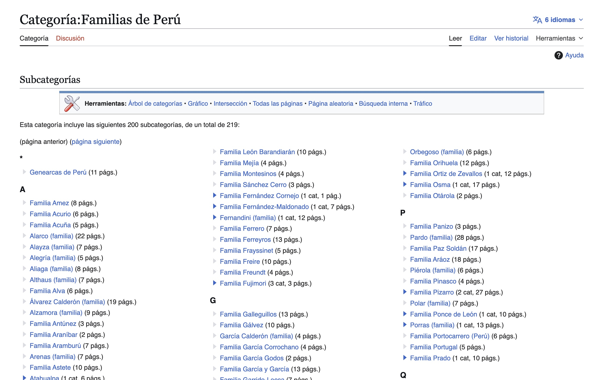{fig-align="center" width="78%"}

## Wikipedia: Data source

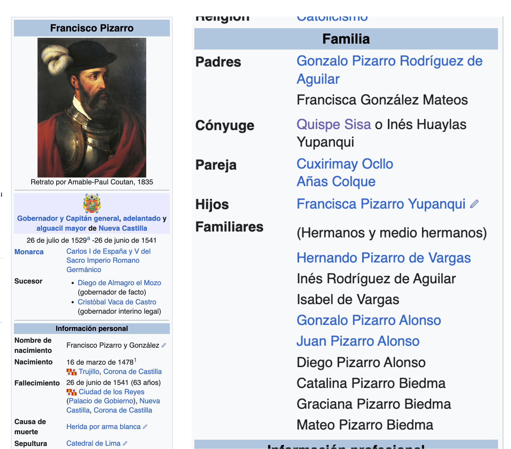{fig-align="center" width="78%"}

## Hypotheses — overview

::: hypotheses-overview-wrap
| **Hyp.** | Core claim                                                                    | Mechanism                                                                |
|-----------------|----------------------------|---------------------------|
| **H1**   | Elite persistence is **mediated by social closure** (endogamy).               | Marriage market as a **defensive buffer** against political turnover.    |
| **H2**   | Elite survival depends on **multidimensional interconnectivity**.             | **Endogamy + transnational ties** jointly buffer shocks.                 |
| **H3**   | Networks shift from **expansive alliances** to **self-referential clusters**. | Intensive kinship substitutes for **weak state institutions** over time. |
:::

# Results

## Initial findings

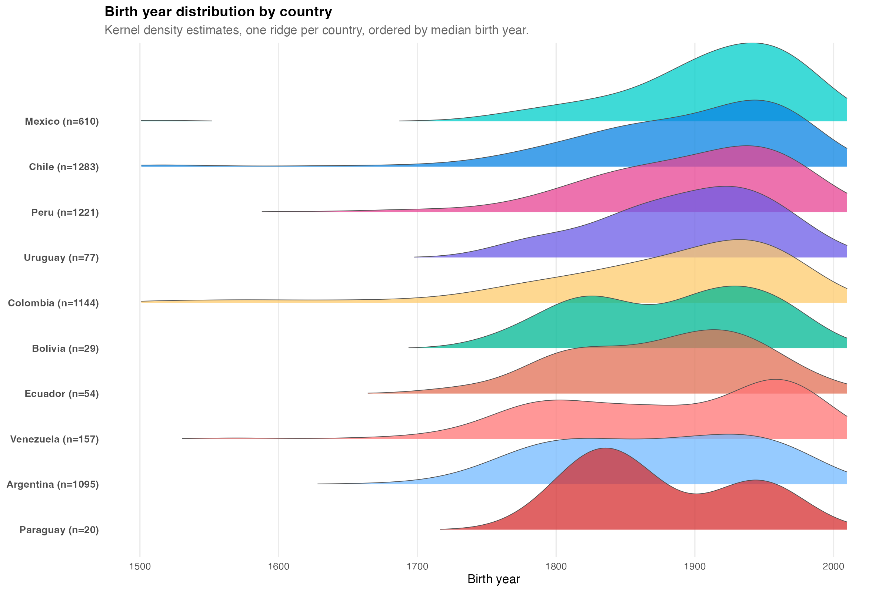{.r-stretch
fig-align="center"}

::: {style="font-size:0.62em; color:#60748e; text-align:center;"}
Birth-year distributions by country (kernel density ridges).

Birth Year Distribution: Continuity vs. Rupture

Elite Persistence (Chile & Mexico): Note the "long-tail" distribution
starting in the 1500s. This reflects a path-dependent continuity where
colonial-era lineages remained visible in the power structure for
centuries. **Modern Concentration:** The significant "bulk" in the 20th
century across all cases highlights the shift toward modern civil
registration and the expansion of the professionalized political class.
:::

------------------------------------------------------------------------

## H1: Endogamy Rates by Country

::: columns
::: {.column width="56%"}
| Country   | Marriages | Endogamy rate | Transnational rate |
|-----------|-----------|---------------|--------------------|
| Paraguay  | 4         | **1.000**     | 0.000              |
| Ecuador   | 10        | 0.900         | 0.200              |
| Mexico    | 108       | 0.870         | 0.139              |
| Argentina | 177       | 0.864         | 0.203              |
| Venezuela | 25        | 0.840         | 0.200              |
| Chile     | 251       | 0.837         | 0.092              |
| Colombia  | 151       | 0.795         | 0.086              |
| Uruguay   | 18        | 0.778         | **0.389**          |
| Peru      | 104       | 0.769         | 0.115              |
| Bolivia   | 3         | 0.667         | 0.667              |
:::

::: {.column width="44%"}
**Reading**

-   Endogamy differs sharply across countries.
-   Larger political fields tend to show lower closure.
-   Uruguay is an outlier in transnational marriage share.
-   Paraguay reaches maximum closure in a very small corpus.
:::
:::

------------------------------------------------------------------------

## H1: National Kinship Layouts (Facets)

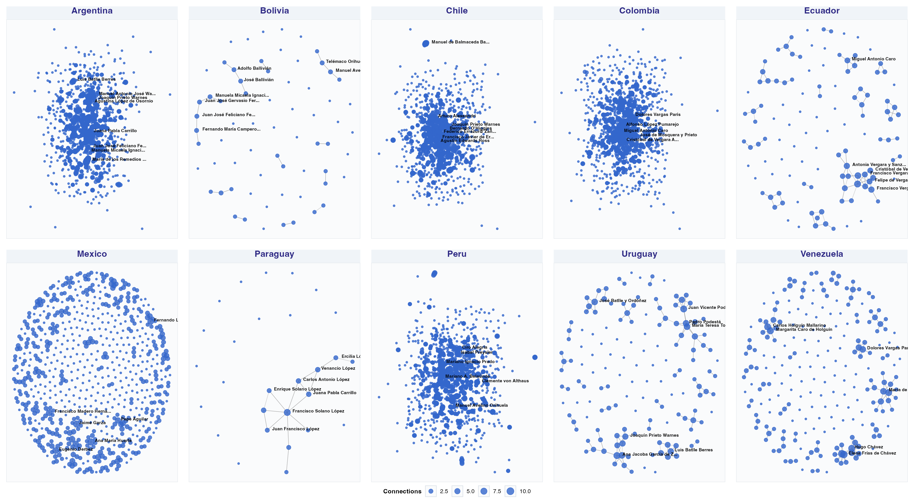{.r-stretch fig-align="center"}

::: {style="font-size:0.56em; color:#60748e; text-align:center;"}
Exploratory faceted layouts by country (Fruchterman–Reingold).
:::

------------------------------------------------------------------------

## H1: Chilean elite

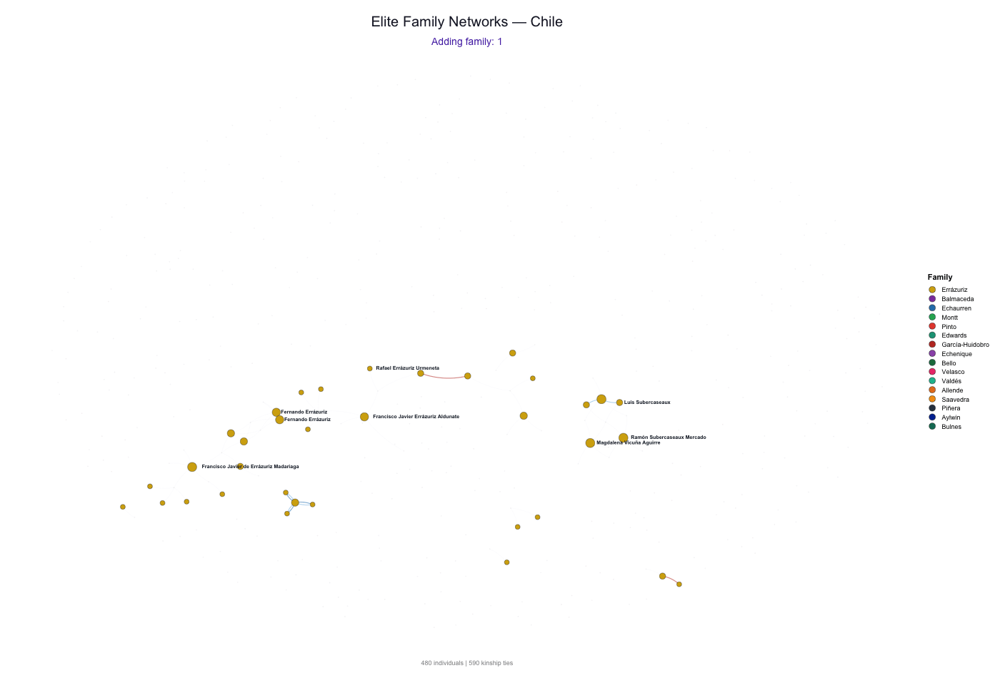{fig-align="center"}

## H1: Argentine elite

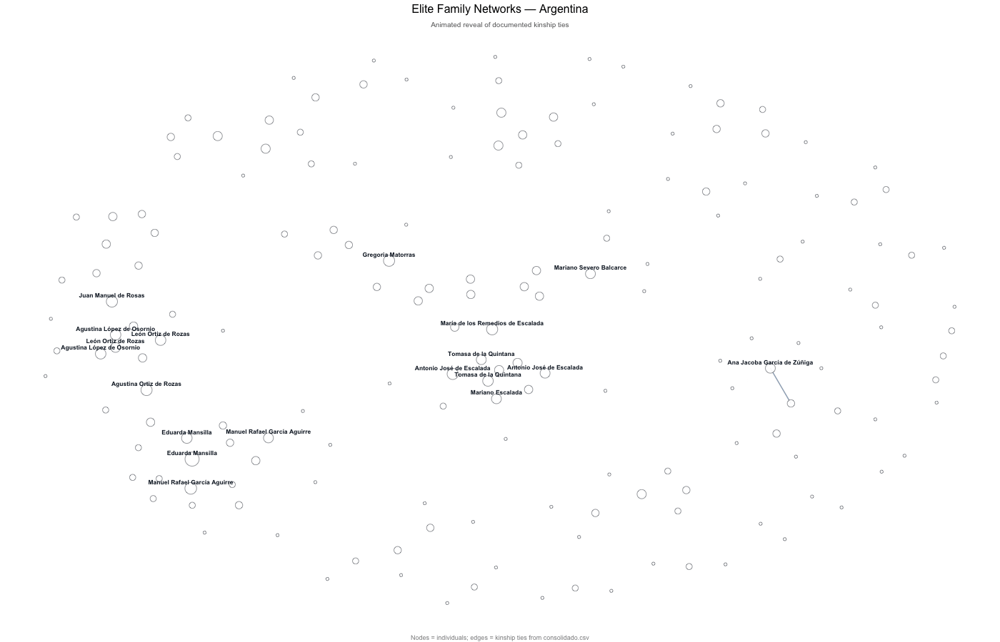{fig-align="center"}

## H1: Mexican elite

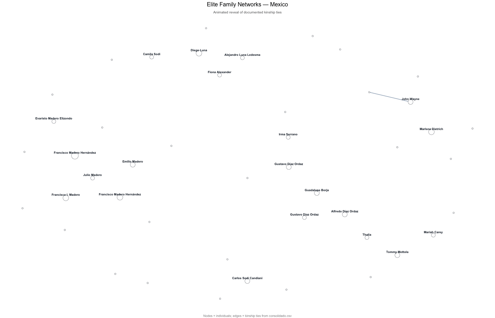{fig-align="center"}

## H2: Transnational Network

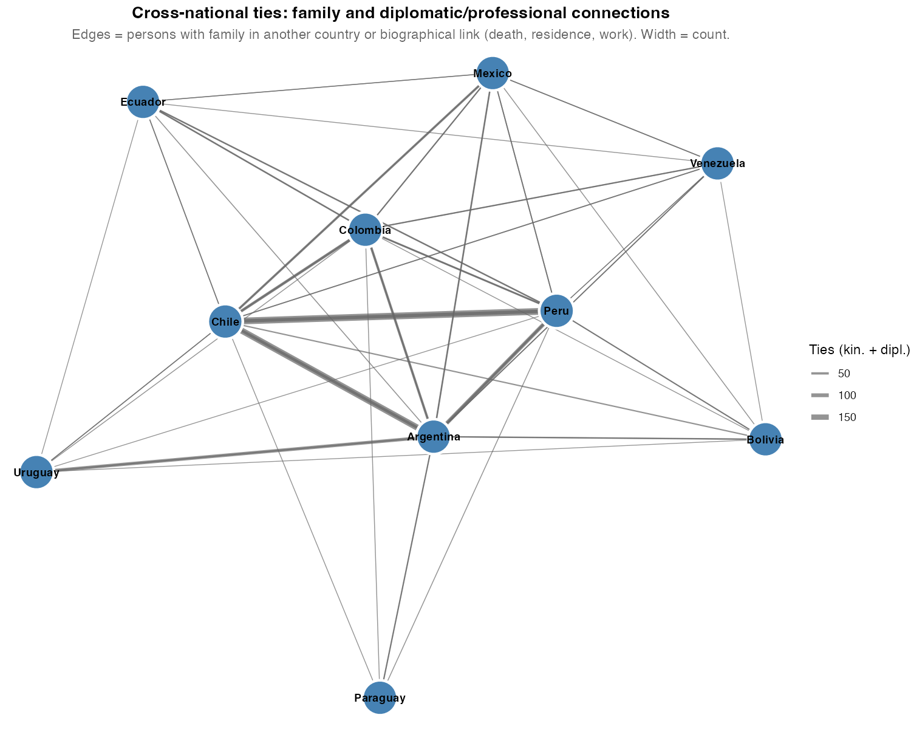{fig-align="center"
width="100%"}

## H2: Transnational Network

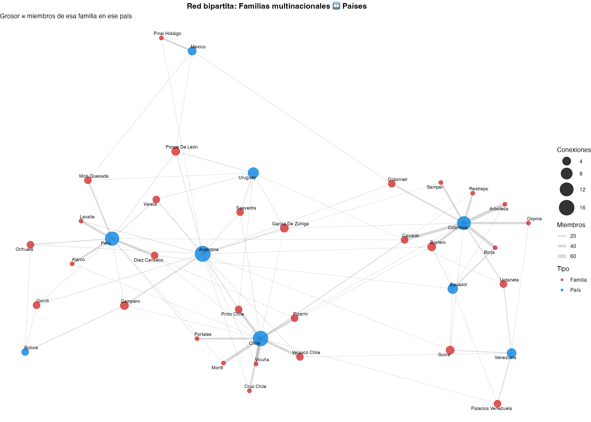{fig-align="center"}

------------------------------------------------------------------------

## H2: Flow Map

::: columns
::: {.column width="52%"}
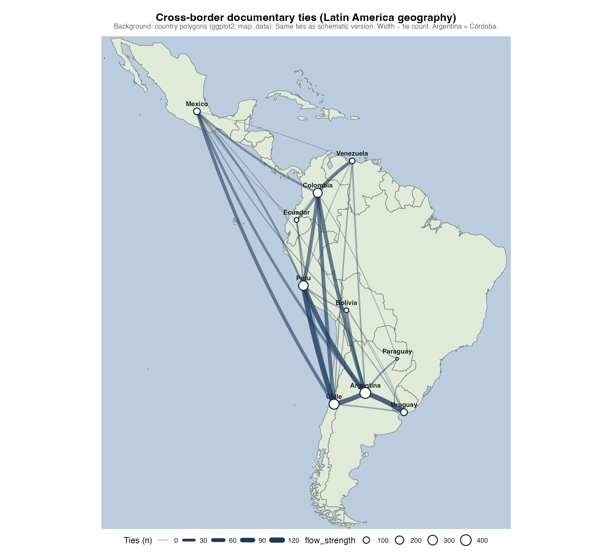{fig-align="center"}

::: {style="font-size:0.5em; color:#60748e; text-align:center;"}
Cross-border ties in the pooled transnational network.
:::
:::

::: {.column width="48%"}
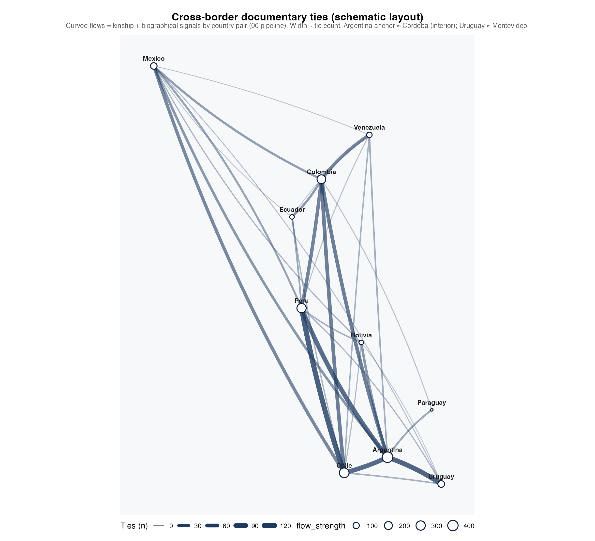{fig-align="center"}

::: {style="font-size:0.5em; color:#60748e; text-align:center;"}
Flow map pooled across all birth cohorts.
:::
:::
:::

# H3: Changes

## H3 · Temporal Consolidation

### Five cohorts, one trajectory

::: columns
::: {.column width="55%"}
| Cohort                   | Edges | Cross-family share | Cross-country share |
|--------------------------|------:|-------------------:|--------------------:|
| Colonial (pre-1800)      | 1,658 |          **17.7%** |                8.6% |
| Independence (1800–1850) | 1,714 |               9.9% |                4.2% |
| Oligarchic (1850–1900)   | 1,556 |               6.7% |                3.0% |
| Republican (1900–1950)   | 2,366 |               5.5% |                4.3% |
| Modern (1950–2000)       |   868 |           **5.3%** |                4.7% |

::: {style="font-size:0.7em; color:#60748e; margin-top:0.4em;"}
Cross-family share = proportion of edges linking distinct surname
clusters. Cross-country share = proportion of edges crossing national
borders. Modern cohort edge count partially reflects right-censoring.
:::
:::

::: {.column width="45%"}
**Two numbers tell the story**

::: {style="background:#f7f9fc; padding:0.7em 1em; border-radius:6px; margin-top:0.3em;"}
Cross-family share:

**17.7% → 5.3%**

A **70% decline** across five successive cohorts
:::

::: {style="font-size:0.85em; margin-top:0.7em;"}
Meanwhile, total edge volume *rises* from 1,658 (Colonial) to 2,366
(Republican) before the censored Modern drop-off.
:::

::: box-primary
More ties. Fewer lineages.
:::
:::
:::

::: {style="font-size:0.75em; color:#60748e; margin-top:0.6em; text-align:center;"}
The network does not shrink. It becomes **self-referential**.
:::

------------------------------------------------------------------------

## H3 · Temporal Consolidation

### The signature of oligarchic consolidation

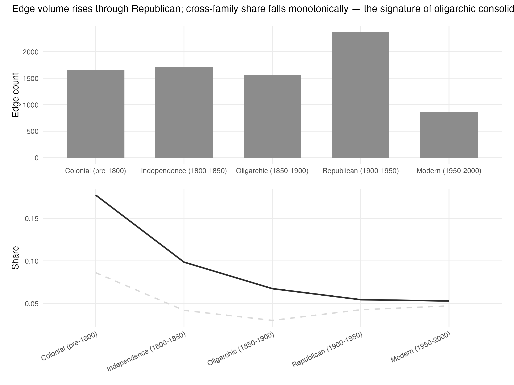{.r-stretch fig-align="center"}

::: {style="font-size:0.5em; color:#60748e; text-align:center; margin-top:0.3em;"}
Cross-family tie share (y-axis) plotted across five birth-year cohorts.
Monotonic decline coincides with the nineteenth-century state-building
period that Centeno (2002) identifies as foundational for Latin American
republics.
:::

::: columns
::: {.column width="50%"}
::: box-primary
**The empirical signature**

Kinship intensification *substitutes* for fiscal-military
institution-building.
:::
:::

::: {.column width="50%"}
::: {style="background:#fef3e6; border-left:4px solid #b8651a; padding:0.6em 0.9em; border-radius:4px; font-size:0.85em;"}
**Centeno (2002):** Latin American states did not fight the mass wars
that forced fiscal-military transformation in Europe.

They produced **"states without wars"** — sustained by elite network
coordination.
:::
:::
:::

------------------------------------------------------------------------

## H3 · Network change

{fig-align="center"}

## H3 · Network change: Education

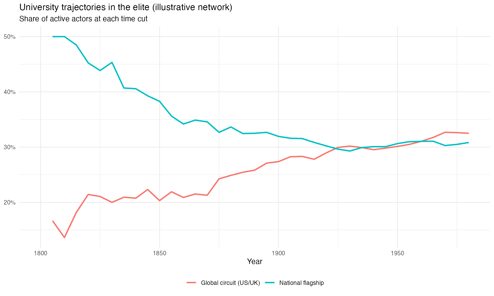{fig-align="center"}

# Toward Causal Identification

::: {style="font-size:0.76em;"}
**1) Cohort designs** with birth-year slicing to test historical timing
of closure and brokerage.

**2) Shock-based comparisons** (e.g., War of the Pacific) for structured
pre/post contrasts.
:::

------------------------------------------------------------------------

## Causal Results: DiD and Event Study

We estimate the effect of major political shocks on elite composition
using a difference-in-differences design with family and year fixed
effects. We leverage three historical ruptures—the Mexican Revolution
(1910), the Chilean coup (1973), and the Argentine coup (1976)—as
quasi-exogenous breaks to identify how regime change reshapes
intra-elite dynamics.

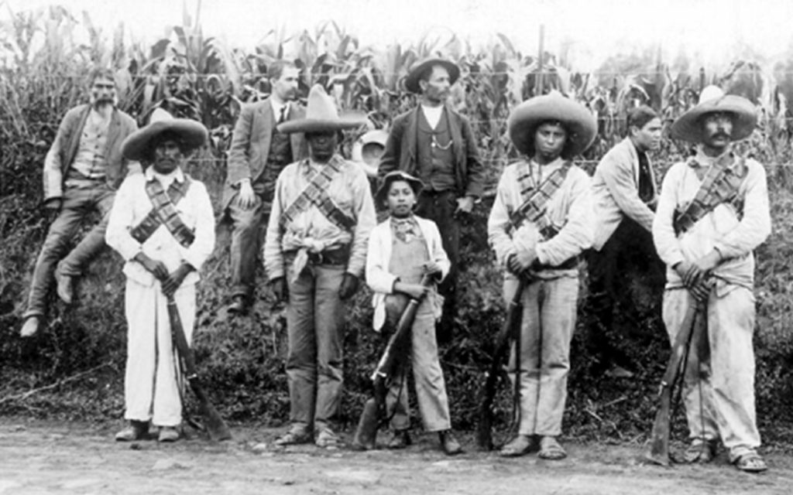{fig-align="center" width="414"}

## Causal Results: DiD and Event Study

**Table 1** shows a significant negative effect of shocks on
state-dependent elites (β ≈ -0.069, p \< 0.001), indicating a decline in
their relative participation compared to market-oriented elites.

The baseline post-shock effect is small and only marginally significant,
suggesting that shocks do not substantially alter the overall size of
the elite.

```{r}
#| echo: false
#| warning: false
#| message: false
did_tbl <- readr::read_csv("tables/table_1_did_main.csv", show_col_types = FALSE)
knitr::kable(did_tbl, digits = 4)
```

------------------------------------------------------------------------

## Figure 1 — Event Study

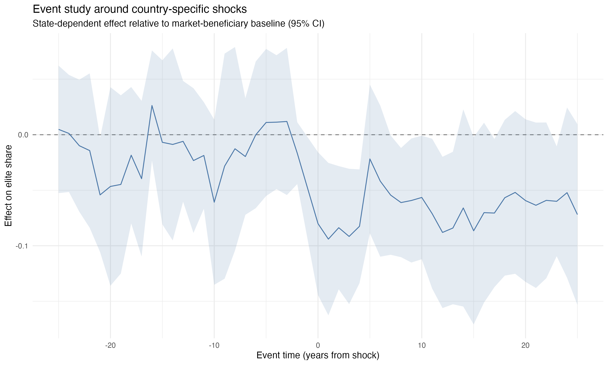{.r-stretch fig-align="center"}

Figure 1 presents event study estimates. Pre-treatment coefficients
remain close to zero, supporting the parallel trends assumption. After
the shock, estimates turn negative and remain persistently below zero,
indicating a sustained decline in the position of state-linked elites.

------------------------------------------------------------------------

## Table 2 — Country Heterogeneity

Table 2 reveals strong cross-national heterogeneity. The decline is
largest in Mexico (β ≈ -0.143), followed by Argentina (β ≈ -0.101), and
substantially smaller in Chile (β ≈ -0.028).

This pattern is consistent with distinct regime dynamics: rupture in
Mexico, recomposition in Argentina, and continuity in Chile.

```{r}
#| echo: false
#| warning: false
#| message: false
het_tbl <- readr::read_csv("tables/table_2_country_heterogeneity.csv", show_col_types = FALSE)
knitr::kable(het_tbl, digits = 4)
```

------------------------------------------------------------------------

## Figure 2 — Probabilities

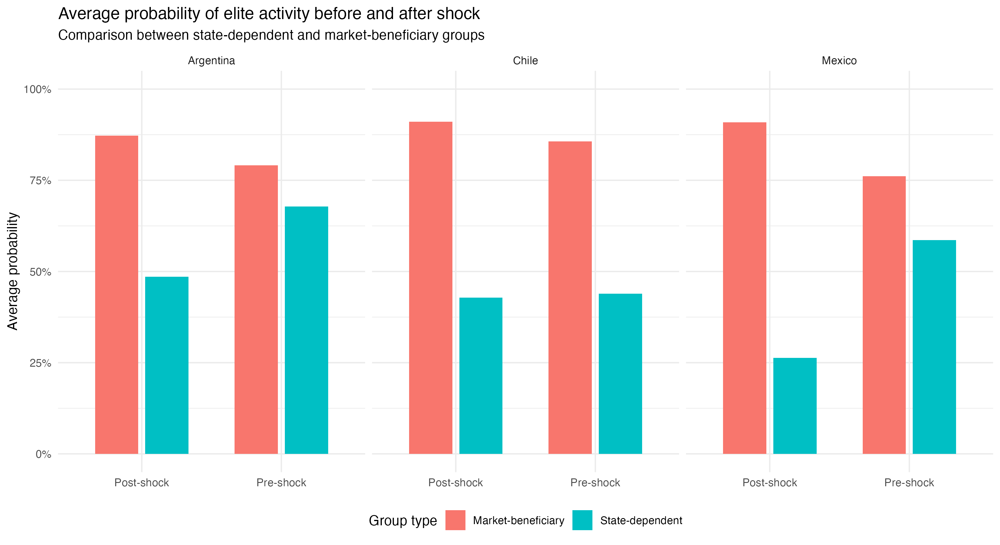{.r-stretch fig-align="center"}

Figure 2 complements these findings by showing changes in the
probability of elite persistence. Across countries, state-dependent
elites exhibit a systematic decline after shocks, while market-oriented
actors maintain or increase their relative position.

Taken together, the results indicate that political shocks do not
eliminate elites but rather reorganize their internal composition, with
heterogeneous effects across national contexts.

------------------------------------------------------------------------

## Broader Implications

::: box-primary
**Democracy:** Where closure and institutional concentration coincide,
accountability faces a structural obstacle.
:::

::: box-primary
**Computational social science:** Large-scale computational
prosopography is feasible with public digital traces.
:::

::: box-highlight
**Public archives:** Open genealogical data can increase both
transparency and elite salience.
:::

## Limitations

::: box-primary
**1) Visibility bias**: Wikipedia disproportionately documents literate,
urban, politically visible individuals. Indigenous, Afro-descendant, and
subnational elites are underrepresented.
:::

::: box-highlight
**2) Kinship incompleteness**: 42.2% of infobox-declared ties do not
resolve to a second scraped biography. Per-country matching rates have
not yet been diagnosed — priority work for next iteration.
:::

::: box-primary
**3) Label uncertainty**: `familia_norm` may merge distinct lineages
(common surname) or split unified ones (orthographic variation across
borders).
:::

::: box-highlight
**4) No causal identification**: Network position measures covary with
regime characteristics. They do not establish that kinship architecture
causes political order — only that the two are structurally entangled in
the documentary record.
:::

------------------------------------------------------------------------

## Key Takeaways for Computational Text Research

-   **Web scraping as data infrastructure**: Public platforms like
    Wikipedia enable large-scale prosopography, but require careful
    handling of bias, coverage, and normalization.
-   **String methods still matter**: Regular expressions, rule-based
    parsing, and name disambiguation remain essential for extracting
    relational data from messy text.
-   **From text to networks**: The key contribution is not only
    extracting entities, but transforming text into relational
    structures (graphs) that allow new types of inference.
-   **LLMs as next step**: Large Language Models can improve extraction,
    resolve ambiguities, and identify implicit relationships (e.g.,
    kinship not explicitly tagged), expanding recall beyond rule-based
    methods.
-   **New research agenda**: Combining web-scraped corpora, network
    analysis, and LLM-assisted annotation opens a path toward scalable,
    comparative historical sociology.

## Package + Future Implications

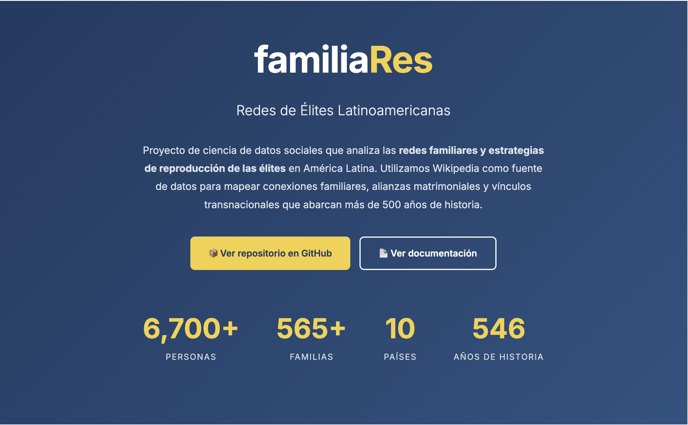{fig-align="center" width="76%"}

::: {style="font-size:0.7em; color:#60748e; text-align:center;"}
-   JSON exports for reproducibility and interoperability\
-   LLM-assisted annotation for exploratory coding support\
-   Open-access release for teaching and replication
:::

------------------------------------------------------------------------

## Next step (for me 🔜 )

##  {#thank-you-slide}

::: thank-you-content
### Thank you!

**Elite Family Networks in Latin America**

*Evidence from Wikipedia Genealogical Data*

**Matías Deneken**

*Methodolab*

[m.deneken\@uc.cl](mailto:m.deneken@uc.cl){.email-link}

[GitHub: \@matdknu](https://github.com/matdknu){.github-link}
:::
